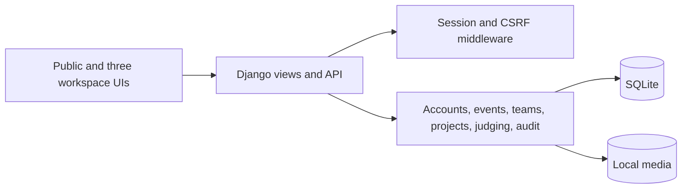

# FairPanel architecture

FairPanel is one Django application with modules for accounts, events, teams, projects, judging, audit, and HTTP APIs. HTML templates and vanilla JavaScript use the same database and permission rules as the `/api/v1/` endpoints. SQLite is the default local database. Docker Compose mounts database and upload volumes and binds the development server to localhost.

## Workspaces and authorization

An `EventMembership` grants one operational role per user and event: organizer, judge, or participant. The role is resolved from the target event on every request. The login page a user selects does not grant privileges. Each role has its own routes, templates, navigation, and preferences. Shared account security applies to the user identity across all workspaces.

- Participants can edit their own team's project until the event deadline. They cannot change event configuration or other teams' submissions.
- Judges can read assignments within their authorized tracks and write their own reviews. They cannot create assignments or read another judge's ballot.
- Organizers can manage owned events, inspect authorized scores, assign judges, mark eligibility, export data, and publish results. They cannot write judge ballots or participant project content.
- Visitors see submitted eligible projects and published result snapshots. Platform admin access is separate from an event organizer role.

Browser authentication uses Django sessions. Unsafe browser requests require CSRF. The API also accepts explicit bearer tokens signed with the installation's secret and valid for 12 hours; the fixture command emits them for the acceptance checker. It does not grant authentication through a role header, arbitrary user ID, or JSON content type. The checker tokens use the same event membership and object permissions as browser sessions.

## Data flow

The official fixture import uses stable external IDs and `get_or_create` for existing records, leaving later organizer edits intact. The fixture event has its published historical deadline; an additional open demo event supports live submissions. Re-running the seeder creates fresh checker sessions, but does not reset imported project and review rows. A deliberate reset command is not implemented.

Submission edits use a version field and a conditional database update to reject stale writes. The server checks ownership and the deadline before writes. The judge assignment endpoint checks event membership, track scope, and team conflicts. Submitted review scores are normalized by `judging/scoring.py` within each track; see [JUDGING.md](JUDGING.md).

The organizer result preview computes a SHA-256 fingerprint from relevant event, project, review, assignment, and rubric fields. Publication requires that fingerprint, rejects stale previews, and records a result revision. Result rows store scores, ranks, project title, tagline, and track label at publication time. Application audit records the actor, action, target, and reason. The audit table is append-only through application paths, but has no cryptographic tamper proof.

## Runtime and limits

The Docker image installs dependencies at build time. Startup migrates and seeds locally; it does not need a hosted database or API. The background video uses a remote URL when online and has a static visual fallback. A truly disconnected first installation needs preloaded Docker images. Docker was unavailable during this handoff, so its startup path is documented but unverified here.

The bundled Compose command uses Django's development server on localhost. SQLite is suitable for the local evaluation baseline; concurrent writes and multi-instance deployment would need separate engineering and testing. The current upload handler and invitations should be reviewed before internet-facing deployment. See [README.md](README.md) for run commands and test evidence.
