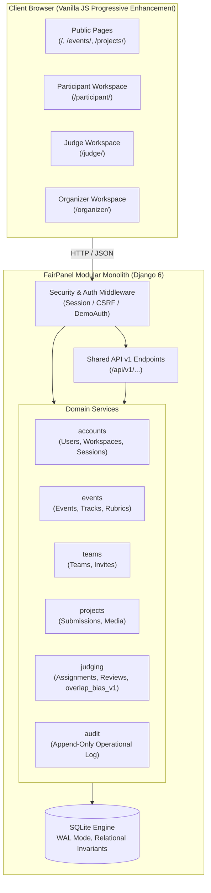

# FairPanel Architecture & System Design

FairPanel is an open-source, self-hosted hackathon submission and judging portal built as a modular Django monolith. It is designed for maximum integrity, complete workspace isolation, transparent evaluation, and zero external runtime dependencies.

---

## 1. Modular Monolith Organization

FairPanel is structured into clean domain apps:
- `accounts`: User identity, password authentication, session management, and role-specific workspace settings (`WorkspaceSettings`).
- `events`: Event lifecycle, tracks, prizes, custom registration questions, and rubric configuration (`Rubric`, `Criterion`).
- `teams`: Team formation, capacity enforcement, member rosters, and cryptographic invite tokens (`TeamInvite`).
- `projects`: Project authoring, 4-step wizard submission, optimistic concurrency versioning (`version`), and deadline boundary enforcement.
- `judging`: Track scopes (`JudgeTrackScope`), balanced round-robin assignments, isolated 3-column review UI, blinded peer score enforcement, `overlap_bias_v1` conservative normalization, and frozen publication snapshots (`ResultSnapshot`, `ResultRow`).
- `audit`: Append-only event history logging operational changes with before/after diffs and operator reasons (`AuditEvent`).
- `api`: Uniform RESTful API layer under `/api/v1/` matching the shared integration contract.

---

## 2. Separation of the Three Workspaces

To prevent permission leaks, operational role ambiguity, or mixed UI states, FairPanel enforces strict route family and template layout separation:

1. **Participant Workspace (`/participant/`)**:
   - Access to team formation, invite link generation, 4-step project submission wizard, and personal participant settings (bio, skills).
   - Edits are locked atomically once the submission window closes (`submissions_close`).
2. **Judge Workspace (`/judge/`)**:
   - Access to assigned review queues, rubric guidance, draft save, final review submission, and conflict-of-interest reporting.
   - **Blinded isolation**: Judges are strictly forbidden from viewing peer judges' scores, rankings, or reviews from other tracks.
3. **Organizer Workspace (`/organizer/`)**:
   - Supervision of managed events, rubric criteria configuration, balanced assignment generation, eligibility reviews with mandatory reasons, results preview (raw vs. adjusted), frozen snapshot publication, and audit log exports.
   - Organizers can inspect completed ballots but **cannot impersonate judges or overwrite individual judge scores**.

---

## 3. Authentication, Sessions & Isolation

- **Django Cookie Sessions**: Standard HttpOnly, SameSite=Lax cookie-based sessions.
- **CSRF Protection**: Browser writes send `X-CSRFToken`; programmatic JSON API calls from test suites/checkers are supported with API auth tokens.
- **Route-Scoped Context**: Context is tied to the requested URL rather than a mutable session-wide active role. Different browser tabs can operate in different events or roles without collision.
- **Account Security**: Password changes and session revocations (`/account/security/`) are clearly separated from workspace preference settings and apply globally across all events.

---

## 4. Offline & Self-Hosted Operation

FairPanel requires no third-party cloud services, hosted databases, or CDN assets at runtime:
- Database: Embedded SQLite in WAL mode with relational foreign keys and unique constraints.
- Media: Stored locally in a dedicated persistent volume.
- Video & Fonts: Full support for the cinematic landing page video when online, paired with an elegant, resilient CSS fallback when offline.
- Docker: Pre-bundled static assets and official fixtures guarantee instant startup even in fully disconnected environments.
