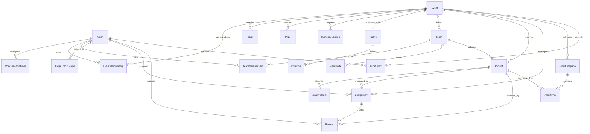

# FairPanel Data Model & Entity Specifications

This document specifies the complete relational schema, domain invariants, foreign keys, unique constraints, and role-based data projection rules for FairPanel.

---

## 1. Domain Entity Relationship Diagram

---

## 2. Core Entities & Schema Reference

### 2.1 Accounts & Workspaces

#### `User` (`fairpanel_users`)
Primary identity entity representing organizers, judges, and participants.
- `id` (`VARCHAR(64)`, Primary Key): Generated using `usr_` prefix (e.g., `usr_28e19c0b0fd94e1d`).
- `email` (`VARCHAR(254)`, Unique, Indexed): Case-insensitive normalized email used as login username.
- `username` (`VARCHAR(150)`, Unique, Indexed): Canonical identifier.
- `display_name` (`VARCHAR(150)`): Human-friendly name displayed across dashboards and leaderboards.
- `password` (`VARCHAR(128)`): PBKDF2/SHA256 password hash.
- `is_active` (`BOOLEAN`, Default `True`): Flag allowing account deactivation.
- `is_staff` (`BOOLEAN`, Default `False`): System administrator privilege flag.
- `date_joined` (`TIMESTAMP`): Creation timestamp.

#### `WorkspaceSettings` (`fairpanel_workspace_settings`)
Per-role workspace preferences isolating user configuration across distinct workspaces.
- `id` (`VARCHAR(64)`, Primary Key): Generated with `ws_` prefix.
- `user_id` (`VARCHAR(64)`, Foreign Key -> `User.id`, `ON DELETE CASCADE`): Owner of the preferences.
- `workspace_type` (`VARCHAR(32)`): Role workspace discriminator: `'organizer'`, `'judge'`, or `'participant'`.
- `preferences` (`JSON`): Arbitrary key-value store for UI density, notification toggles, theme, etc.
- `version` (`INTEGER`, Default `1`): Optimistic concurrency version counter.
- `updated_at` (`TIMESTAMP`): Automatic timestamp on modification.
- **Constraints**: Unique constraint on `(user_id, workspace_type)`.

---

### 2.2 Events & Configuration

#### `Event` (`fairpanel_events`)
Hackathon container orchestrating timelines, scopes, and rules.
- `id` (`VARCHAR(64)`, Primary Key): Generated with `evt_` prefix (e.g., `evt_01`, `evt_demo`).
- `owner_id` (`VARCHAR(64)`, Foreign Key -> `User.id`, `ON DELETE CASCADE`): Lead organizer.
- `name` (`VARCHAR(255)`): Public event title.
- `description` (`TEXT`): Full markdown event description.
- `timezone` (`VARCHAR(64)`, Default `'UTC'`): IANA timezone string for deadline display.
- `submissions_open` (`TIMESTAMP`, Nullable): Opening timestamp for participant submissions.
- `submissions_close` (`TIMESTAMP`, Nullable): Hard closing deadline for participant submissions.
- `judging_open` (`TIMESTAMP`, Nullable): Start timestamp for evaluation phase.
- `judging_close` (`TIMESTAMP`, Nullable): Hard closing timestamp for judge evaluation.
- `status` (`VARCHAR(32)`, Default `'active'`): Workflow stage: `'draft'`, `'active'`, `'judging'`, `'published'`, `'archived'`.
- `team_capacity` (`INTEGER`, Default `4`): Maximum team size limit.
- `min_reviews_per_project` (`INTEGER`, Default `3`): Target evaluation coverage for assignment balancing.
- `results_published_at` (`TIMESTAMP`, Nullable): Timestamp of initial public score publication.
- `created_at` (`TIMESTAMP`): Record creation timestamp.
- `updated_at` (`TIMESTAMP`): Record update timestamp.

#### `EventMembership` (`fairpanel_event_memberships`)
Explicit role binding between a user and an event.
- `id` (`VARCHAR(64)`, Primary Key): Generated with `mbr_` prefix.
- `user_id` (`VARCHAR(64)`, Foreign Key -> `User.id`, `ON DELETE CASCADE`).
- `event_id` (`VARCHAR(64)`, Foreign Key -> `Event.id`, `ON DELETE CASCADE`).
- `role` (`VARCHAR(32)`): `'organizer'`, `'judge'`, or `'participant'`.
- `created_at` (`TIMESTAMP`): Binding timestamp.
- **Constraints**: Unique constraint on `(user_id, event_id)`.

#### `Track` (`fairpanel_tracks`)
Specialized competition categories or verticals.
- `id` (`VARCHAR(64)`, Primary Key): Generated with `trk_` prefix.
- `event_id` (`VARCHAR(64)`, Foreign Key -> `Event.id`, `ON DELETE CASCADE`).
- `name` (`VARCHAR(255)`): Track name (e.g., "AI & Machine Learning", "Open Infrastructure").
- `description` (`TEXT`): Track goals, rules, and technical boundaries.

#### `Prize` (`fairpanel_prizes`)
Track-specific or general competition awards.
- `id` (`VARCHAR(64)`, Primary Key): Generated with `prz_` prefix.
- `event_id` (`VARCHAR(64)`, Foreign Key -> `Event.id`, `ON DELETE CASCADE`).
- `name` (`VARCHAR(255)`): Prize title (e.g., "Grand Prize", "Best Hardware Hack").
- `description` (`TEXT`): Eligibility and qualification criteria.
- `amount` (`VARCHAR(100)`): Reward value or monetary amount (e.g., "$10,000 USD").

#### `CustomQuestion` (`fairpanel_custom_questions`)
Custom registration and submission prompts defined by organizers.
- `id` (`VARCHAR(64)`, Primary Key): Generated with `qst_` prefix.
- `event_id` (`VARCHAR(64)`, Foreign Key -> `Event.id`, `ON DELETE CASCADE`).
- `key` (`VARCHAR(64)`): Machine identifier (e.g., `"github_org"`, `"cloud_credits_opt_in"`).
- `label` (`VARCHAR(255)`): Form field question text.
- `type` (`VARCHAR(32)`): Input widget: `'text'`, `'textarea'`, `'select'`, `'checkbox'`.
- `required` (`BOOLEAN`, Default `False`).
- `choices` (`JSON`, Default `[]`): Array of strings for select options.
- `order` (`INTEGER`, Default `0`): Display ordering weight.

#### `Rubric` (`fairpanel_rubrics`)
Evaluation framework containing individual scoring criteria.
- `id` (`VARCHAR(64)`, Primary Key): Generated with `rub_` prefix.
- `event_id` (`VARCHAR(64)`, OneToOne -> `Event.id`, `ON DELETE CASCADE`).
- `version` (`INTEGER`, Default `1`): Monotonically increasing rubric definition version.
- `is_locked` (`BOOLEAN`, Default `False`): Prevents rubric modifications once judging begins.

#### `Criterion` (`fairpanel_criteria`)
Individual assessment dimensions within a rubric.
- `id` (`VARCHAR(64)`, Primary Key): Generated with `crt_` prefix.
- `rubric_id` (`VARCHAR(64)`, Foreign Key -> `Rubric.id`, `ON DELETE CASCADE`).
- `key` (`VARCHAR(64)`): Canonical identifier (e.g., `"technical_execution"`, `"innovation"`).
- `name` (`VARCHAR(255)`): Human label displayed to judges.
- `description` (`TEXT`): Scoring guidance and anchor definitions.
- `min_score` (`FLOAT`, Default `1.0`): Minimum score value.
- `max_score` (`FLOAT`, Default `5.0`): Maximum score value.
- `weight` (`FLOAT`, Default `1.0`): Multiplier used in weighted normalization.
- `order` (`INTEGER`, Default `0`): UI rendering order.

---

### 2.3 Teams & Projects

#### `Team` (`fairpanel_teams`)
Collaboration unit formed by participants to submit a project.
- `id` (`VARCHAR(64)`, Primary Key): Generated with `tem_` prefix.
- `event_id` (`VARCHAR(64)`, Foreign Key -> `Event.id`, `ON DELETE CASCADE`).
- `captain_id` (`VARCHAR(64)`, Foreign Key -> `User.id`, `ON DELETE CASCADE`): Creator/leader.
- `name` (`VARCHAR(255)`): Public team name.
- `capacity` (`INTEGER`, Default `4`): Cap on roster size.
- `created_at` (`TIMESTAMP`): Team registration timestamp.

#### `TeamMembership` (`fairpanel_team_memberships`)
Individual participant membership in a team.
- `id` (`VARCHAR(64)`, Primary Key): Generated with `tmb_` prefix.
- `team_id` (`VARCHAR(64)`, Foreign Key -> `Team.id`, `ON DELETE CASCADE`).
- `user_id` (`VARCHAR(64)`, Foreign Key -> `User.id`, `ON DELETE CASCADE`).
- `joined_at` (`TIMESTAMP`): Join timestamp.
- **Constraints**: Unique constraint on `(team_id, user_id)`.

#### `TeamInvite` (`fairpanel_team_invites`)
Cryptographically secured team recruitment invitations.
- `id` (`VARCHAR(64)`, Primary Key): Generated with `tiv_` prefix.
- `team_id` (`VARCHAR(64)`, Foreign Key -> `Team.id`, `ON DELETE CASCADE`).
- `token_hash` (`VARCHAR(128)`, Unique): SHA-256 hash of the invite token secret.
- `raw_token` (`VARCHAR(128)`): Masked or raw token representation for dev/demo display.
- `invited_email` (`VARCHAR(254)`, Nullable): Optional email restriction.
- `creator_id` (`VARCHAR(64)`, Foreign Key -> `User.id`, `ON DELETE CASCADE`).
- `expiry` (`TIMESTAMP`, Nullable): Expiration deadline.
- `usage_limit` (`INTEGER`, Default `1`): Maximum number of redemptions.
- `times_used` (`INTEGER`, Default `0`): Redemptions counter.
- `revoked_at` (`TIMESTAMP`, Nullable): Revocation timestamp if cancelled early.
- `created_at` (`TIMESTAMP`): Creation timestamp.

#### `Project` (`fairpanel_projects`)
The submission artifact subjected to evaluation.
- `id` (`VARCHAR(64)`, Primary Key): Generated with `prj_` prefix.
- `event_id` (`VARCHAR(64)`, Foreign Key -> `Event.id`, `ON DELETE CASCADE`).
- `team_id` (`VARCHAR(64)`, Foreign Key -> `Team.id`, `ON DELETE CASCADE`).
- `track_id` (`VARCHAR(64)`, Foreign Key -> `Track.id`, `ON DELETE SET NULL`, Nullable).
- `title` (`VARCHAR(255)`): Project title.
- `tagline` (`VARCHAR(500)`): Short one-line summary.
- `description` (`TEXT`): Detailed markdown description.
- `thumbnail_url` (`VARCHAR(1000)`): Primary visual banner image URL.
- `images` (`JSON`, Default `[]`): Gallery of screenshot URLs.
- `video_url` (`VARCHAR(1000)`): Demo video link (YouTube, Vimeo, MP4).
- `repo_url` (`VARCHAR(1000)`): Source code repository URL.
- `live_url` (`VARCHAR(1000)`): Deployed demo application URL.
- `tech_tags` (`JSON`, Default `[]`): Array of technology tags (e.g., `["Python", "WebAssembly"]`).
- `custom_answers` (`JSON`, Default `{}`): Key-value responses to custom event questions.
- `status` (`VARCHAR(32)`, Default `'draft'`): Submission state: `'draft'`, `'submitted'`.
- `eligibility` (`VARCHAR(32)`, Default `'eligible'`): `'eligible'` or `'ineligible'`.
- `eligibility_reason` (`TEXT`): Mandatory explanation logged when disqualified by an organizer.
- `submitted_at` (`TIMESTAMP`, Nullable): Final submission timestamp.
- `updated_at` (`TIMESTAMP`): Auto-updated modification timestamp.
- `version` (`INTEGER`, Default `1`): Optimistic concurrency version check.

#### `ProjectMedia` (`fairpanel_project_media`)
Uploaded local file attachments.
- `id` (`VARCHAR(64)`, Primary Key): Generated with `med_` prefix.
- `project_id` (`VARCHAR(64)`, Foreign Key -> `Project.id`, `ON DELETE CASCADE`, Nullable).
- `file` (`FILE`): Stored relative path in persistent media storage.
- `filename` (`VARCHAR(255)`): Original uploaded filename.
- `file_type` (`VARCHAR(64)`): MIME type.
- `file_size` (`INTEGER`): File size in bytes.
- `order` (`INTEGER`, Default `0`): Presentation sequence.
- `uploaded_by_id` (`VARCHAR(64)`, Foreign Key -> `User.id`, `ON DELETE CASCADE`).
- `created_at` (`TIMESTAMP`): Upload timestamp.

---

### 2.4 Judging & Normalization

#### `JudgeTrackScope` (`fairpanel_judge_track_scopes`)
Track assignment restrictions for judges.
- `id` (`VARCHAR(64)`, Primary Key): Generated with `jts_` prefix.
- `judge_id` (`VARCHAR(64)`, Foreign Key -> `User.id`, `ON DELETE CASCADE`).
- `event_id` (`VARCHAR(64)`, Foreign Key -> `Event.id`, `ON DELETE CASCADE`).
- `tracks` (`ManyToManyField` -> `Track`): Assigned tracks (empty represents all tracks).
- **Constraints**: Unique constraint on `(judge_id, event_id)`.

#### `JudgeInvite` (`fairpanel_judge_invites`)
Recruitment tokens for onboarding judges.
- `id` (`VARCHAR(64)`, Primary Key): Generated with `jin_` prefix.
- `event_id` (`VARCHAR(64)`, Foreign Key -> `Event.id`, `ON DELETE CASCADE`).
- `token_hash` (`VARCHAR(128)`, Unique): SHA-256 token digest.
- `raw_token` (`VARCHAR(128)`): Dev/demo raw token.
- `invited_email` (`VARCHAR(254)`, Nullable): Designated email restriction.
- `creator_id` (`VARCHAR(64)`, Foreign Key -> `User.id`, `ON DELETE CASCADE`).
- `tracks` (`JSON`, Default `[]`): Pre-assigned track IDs.
- `expiry` (`TIMESTAMP`, Nullable): Expiry timestamp.
- `usage_limit` (`INTEGER`, Default `1`).
- `times_used` (`INTEGER`, Default `0`).
- `revoked_at` (`TIMESTAMP`, Nullable).
- `created_at` (`TIMESTAMP`).

#### `Assignment` (`fairpanel_assignments`)
Pairing between a judge and an eligible project.
- `id` (`VARCHAR(64)`, Primary Key): Generated with `asg_` prefix.
- `event_id` (`VARCHAR(64)`, Foreign Key -> `Event.id`, `ON DELETE CASCADE`).
- `project_id` (`VARCHAR(64)`, Foreign Key -> `Project.id`, `ON DELETE CASCADE`).
- `judge_id` (`VARCHAR(64)`, Foreign Key -> `User.id`, `ON DELETE CASCADE`).
- `status` (`VARCHAR(32)`, Default `'assigned'`): `'assigned'`, `'conflict'`, `'completed'`.
- `conflict_reason` (`TEXT`): Reported conflict of interest justification.
- `assigned_at` (`TIMESTAMP`): Creation timestamp.
- **Constraints**: Unique constraint on `(project_id, judge_id)`.

#### `Review` (`fairpanel_reviews`)
Evaluative ballot containing numerical scores and feedback.
- `id` (`VARCHAR(64)`, Primary Key): Generated with `rev_` prefix.
- `assignment_id` (`VARCHAR(64)`, OneToOne -> `Assignment.id`, Nullable, `ON DELETE CASCADE`).
- `project_id` (`VARCHAR(64)`, Foreign Key -> `Project.id`, `ON DELETE CASCADE`).
- `judge_id` (`VARCHAR(64)`, Foreign Key -> `User.id`, `ON DELETE CASCADE`).
- `rubric_version` (`INTEGER`, Default `1`): Rubric version at time of scoring.
- `criteria_scores` (`JSON`): Dictionary mapping criterion key to numeric score (e.g., `{"clarity": 4.5}`).
- `comment` (`TEXT`): Qualitative feedback and evaluation notes.
- `status` (`VARCHAR(32)`, Default `'draft'`): `'draft'`, `'submitted'`.
- `version` (`INTEGER`, Default `1`): Optimistic concurrency version counter.
- `submitted_at` (`TIMESTAMP`, Nullable): Submission timestamp.
- `updated_at` (`TIMESTAMP`): Update timestamp.
- **Constraints**: Unique constraint on `(project_id, judge_id)`.

#### `ResultSnapshot` (`fairpanel_result_snapshots`)
Immutable, frozen publication of tournament results.
- `id` (`VARCHAR(64)`, Primary Key): Generated with `snp_` prefix.
- `event_id` (`VARCHAR(64)`, Foreign Key -> `Event.id`, `ON DELETE CASCADE`).
- `revision` (`INTEGER`, Default `1`): Sequential publication revision number.
- `ranking_method` (`VARCHAR(32)`): Method chosen for official standing: `'raw'` or `'adjusted'`.
- `input_fingerprint` (`VARCHAR(128)`): Cryptographic hash of input score matrices and parameters.
- `warnings_acknowledged` (`JSON`, Default `[]`): Array of warnings acknowledged by organizer prior to freeze.
- `reason` (`TEXT`): Organizer rationale for publishing or revising results.
- `published_at` (`TIMESTAMP`): Publication timestamp.
- `published_by_id` (`VARCHAR(64)`, Foreign Key -> `User.id`, Nullable, `ON DELETE SET NULL`).

#### `ResultRow` (`fairpanel_result_rows`)
Individual project standing within a result snapshot.
- `id` (`VARCHAR(64)`, Primary Key): Generated with `row_` prefix.
- `snapshot_id` (`VARCHAR(64)`, Foreign Key -> `ResultSnapshot.id`, `ON DELETE CASCADE`).
- `project_id` (`VARCHAR(64)`, Foreign Key -> `Project.id`, `ON DELETE CASCADE`).
- `raw_score` (`FLOAT`, Nullable): Weighted mean of eligible submitted judge scores (0-100); null when unreviewed.
- `adjusted_score` (`FLOAT`, Nullable): Overlap-bias normalized score.
- `raw_rank` (`INTEGER`, Nullable): Competition rank within the track; null when unreviewed.
- `project_title`, `project_tagline`, `track_name` (`VARCHAR`): Labels copied into the publication snapshot so later edits do not rewrite public history.
- `adjusted_rank` (`INTEGER`, Nullable): Final ordinal position based on adjusted score.
- `review_count` (`INTEGER`, Default `0`): Total submitted reviews.
- `eligible_review_count` (`INTEGER`, Default `0`): Reviews from eligible calibrated judges.
- `normalization_status` (`VARCHAR(64)`): `'calibrated'`, `'mixed'`, `'uncalibrated'`.
- `warnings` (`JSON`, Default `[]`): Project-specific evaluation warnings.
- `tied` (`BOOLEAN`, Default `False`): Flag indicating tied score with neighboring ranks.

---

### 2.5 Audit Trail

#### `AuditEvent` (`fairpanel_audit_events`)
Append-only operational event ledger tracking sensitive modifications.
- `id` (`VARCHAR(64)`, Primary Key): Generated with `aud_` prefix.
- `event_id` (`VARCHAR(64)`, Foreign Key -> `Event.id`, Nullable, `ON DELETE SET NULL`).
- `actor_id` (`VARCHAR(64)`, Foreign Key -> `User.id`, Nullable, `ON DELETE SET NULL`).
- `action` (`VARCHAR(64)`): Operation identifier (e.g., `'project.disqualify'`, `'rubric.update'`, `'results.publish'`).
- `target` (`VARCHAR(128)`): Identifier of affected entity.
- `reason` (`TEXT`): Operator-provided explanation for operational changes.
- `before_data` (`JSON`): State snapshot prior to change.
- `after_data` (`JSON`): State snapshot following change.
- `created_at` (`TIMESTAMP`): Tamper-resistant recording timestamp.

---

## 3. Projection & Visibility Rules

To prevent information disclosure and ensure competition fairness, data models are projected into distinct views based on client authorization.

| Field / Model | Public (`/`, `/projects/`) | Participant (`/participant/`) | Judge (`/judge/`) | Organizer (`/organizer/`) |
| :--- | :--- | :--- | :--- | :--- |
| **`Project.status`** | Visible if `submitted` | Full team project access | Assigned projects only | Full event project access |
| **`Project.eligibility_reason`** | Hidden | Visible to team | Hidden | Full access (editable) |
| **`Project.custom_answers`** | Hidden | Full team access | Visible (if relevant) | Full access |
| **`Review.criteria_scores`** | Hidden until published | Hidden during judging | **Own scores only** | All judges' scores |
| **Peer Judge Scores** | **Hidden** | **Hidden** | **STRICTLY FORBIDDEN (403)** | Visible across all ballots |
| **`ResultSnapshot`** | Visible when published | Visible when published | Visible when published | Full preview & history |
| **`AuditEvent`** | Hidden | Hidden | Hidden | Full searchable audit trail |
| **`JudgeInvite` / `TeamInvite`** | Hidden | Team tokens only | Assigned tokens only | All event tokens |

These projection rules are enforced at the API controller layer and validated against unauthorized access via automated test probes.
