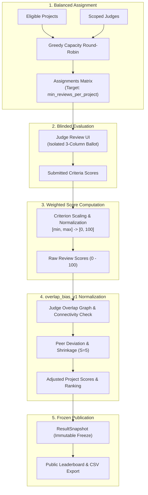

# FairPanel Judging & Normalization System

FairPanel implements a transparent, peer-calibrated evaluation pipeline designed to minimize inter-judge scoring bias while maintaining mathematical conservatism and robust fallback behaviors.

---

## 1. Overview of the Evaluation Pipeline

---

## 2. Balanced Assignment Algorithm

FairPanel's assignment engine (`generate_balanced_assignments`) creates an equitable distribution of projects across available judges while strictly observing operational constraints:

1. **Track Isolation**:
   - Judges scoped to specific tracks (`JudgeTrackScope`) only receive projects belonging to those tracks.
   - Judges without explicit track restrictions are treated as general pool evaluators.
2. **Conflict Avoidance**:
   - Team members cannot be assigned to review projects submitted by their own team.
   - Any prior reported conflict of interest permanently disqualifies that judge-project pair.
3. **Coverage Balancing**:
   - Projects with fewer existing assignments are prioritized first.
   - Judges with fewer active assignments are selected next, preventing reviewer fatigue.
   - The engine iterates until every eligible project reaches `min_reviews_per_project` (default: 3) or judge capacity is exhausted.

---

## 3. Weighted Scoring Formula

Each review evaluates a project across rubric criteria $C = \{c_1, c_2, \dots, c_m\}$. Each criterion $c$ defines a minimum score $\text{min}_c$, maximum score $\text{max}_c$, and a positive weight $w_c$.

1. **Criterion Normalization**:
   The raw score $r_c \in [\text{min}_c, \text{max}_c]$ is normalized to the unit interval $[0, 1]$:
   $$\tilde{r}_c = \frac{r_c - \text{min}_c}{\text{max}_c - \text{min}_c}, \quad \text{clamped to } [0, 1]$$

2. **Normalized Weight**:
   $$\tilde{w}_c = \frac{w_c}{\sum_{k=1}^m w_k}$$

3. **Single Review Score**:
   The final review score $S_r \in [0, 100]$ is:
   $$S_r = 100 \times \sum_{c \in C} \left(\tilde{w}_c \cdot \tilde{r}_c\right)$$

---

## 4. The `overlap_bias_v1` Normalization Algorithm

In hackathon judging, different judges exhibit systematic differences in scoring tendencies: "harsh" judges grade consistently lower than average, while "lenient" judges grade higher. `overlap_bias_v1` detects and neutralizes these individual judge biases using conservative empirical Bayes shrinkage.

### 4.1 Step 1: Overlap Graph & Connected Components
A project $p$ is considered an *overlap project* if it was evaluated by two or more judges ($|J_p| \ge 2$). 

An undirected graph $G = (V, E)$ is constructed where vertices $V$ are judges and an edge $(j_a, j_b) \in E$ exists if $j_a$ and $j_b$ co-evaluated at least one project.
- Breadth-First Search (BFS) is executed to discover connected components.
- If the overlap graph is disconnected, judges in disconnected partitions cannot be compared directly against the main pool. A pool warning is raised, and calibration is restricted to the largest connected component.

### 4.2 Step 2: Constant Scorer Detection
Judges who award identical scores across all their assignments provide zero discriminative signal:
$$\sigma_j^2 = \frac{1}{|P_j|} \sum_{p \in P_j} (s_{j,p} - \bar{s}_j)^2$$
If $|P_j| \ge 2$ and $\sigma_j^2 < 10^{-6}$, the judge is marked as a **constant scorer**. Their bias is set to 0.0, and a warning is logged.

### 4.3 Step 3: Peer Difference Calculation
For each project $p$ where judge $j$ evaluated alongside other judges:
$$\bar{s}_{-j, p} = \frac{1}{|J_p| - 1} \sum_{k \in J_p \setminus \{j\}} s_{k,p}$$
$$\text{diff}_{j,p} = s_{j,p} - \bar{s}_{-j,p}$$

The judge's raw severity (leniency) across all $n_{\text{overlap}}$ shared projects is:
$$\bar{d}_j = \frac{1}{n_{\text{overlap}}} \sum_{p \in P_j \cap P_{\text{overlap}}} \text{diff}_{j,p}$$

### 4.4 Step 4: Conservative Shrinkage ($S = 5$)
To prevent small-sample noise from distorting scores, FairPanel shrinks the estimated severity toward zero using shrinkage constant $S = 5$:
$$\text{shrinkage factor} = \frac{n_{\text{overlap}}}{n_{\text{overlap}} + 5}$$
$$\text{shrunk\_severity}_j = \bar{d}_j \times \left(\frac{n_{\text{overlap}}}{n_{\text{overlap}} + 5}\right)$$

**Calibration Gates**:
A judge is only calibrated if:
1. $n_{\text{overlap}} \ge 3$ projects.
2. The judge is not flagged as a constant scorer.
3. The judge belongs to the primary connected component.

If any gate fails, $\text{shrunk\_severity}_j = 0.0$ and `judge_calibrated[j] = False`.

### 4.5 Step 5: Adjusted Project Scores
For each project $p$ with judges $J_p$:
$$s_{p,\text{adj}} = \frac{1}{|J_p|} \sum_{j \in J_p} \left(s_{j,p} - \text{shrunk\_severity}_j\right)$$

- If all judges are calibrated: `normalization_status = "calibrated"`.
- If some judges are calibrated: `normalization_status = "mixed"`.
- If no judges are calibrated: `normalization_status = "uncalibrated"`.

---

## 5. Worked Numerical Example

Consider 3 judges ($J_1, J_2, J_3$) evaluating 3 projects ($P_A, P_B, P_C$). Each judge evaluates all 3 projects ($n_{\text{overlap}} = 3$).

### Criterion Definition
- Standard rubric: Single criterion, $\text{min} = 0$, $\text{max} = 100$, $\text{weight} = 1.0$.

### Raw Submitted Scores
| Project | $J_1$ (Harsh) | $J_2$ (Fair) | $J_3$ (Generous) | Project Raw Mean |
| :--- | :---: | :---: | :---: | :---: |
| **$P_A$** | 70 | 80 | 90 | **80.00** |
| **$P_B$** | 60 | 70 | 80 | **70.00** |
| **$P_C$** | 80 | 85 | 95 | **86.67** |

---

### Step-by-Step Bias Calibration

#### Judge $J_1$
- $P_A$: Peer mean $= (80 + 90)/2 = 85$. Diff $= 70 - 85 = -15.0$.
- $P_B$: Peer mean $= (70 + 80)/2 = 75$. Diff $= 60 - 75 = -15.0$.
- $P_C$: Peer mean $= (85 + 95)/2 = 90$. Diff $= 80 - 90 = -10.0$.
- Raw Severity $\bar{d}_{J_1} = \frac{-15.0 - 15.0 - 10.0}{3} = -13.33$.
- Shrinkage ($n=3, S=5$): $\frac{3}{3 + 5} = \frac{3}{8} = 0.375$.
- **$\text{shrunk\_severity}_{J_1} = -13.33 \times 0.375 = -5.00$**.

#### Judge $J_2$
- $P_A$: Peer mean $= (70 + 90)/2 = 80$. Diff $= 80 - 80 = 0.0$.
- $P_B$: Peer mean $= (60 + 80)/2 = 70$. Diff $= 70 - 70 = 0.0$.
- $P_C$: Peer mean $= (80 + 95)/2 = 87.5$. Diff $= 85 - 87.5 = -2.5$.
- Raw Severity $\bar{d}_{J_2} = \frac{0.0 + 0.0 - 2.5}{3} = -0.83$.
- Shrinkage: $\frac{3}{8} = 0.375$.
- **$\text{shrunk\_severity}_{J_2} = -0.83 \times 0.375 = -0.31$**.

#### Judge $J_3$
- $P_A$: Peer mean $= (70 + 80)/2 = 75$. Diff $= 90 - 75 = +15.0$.
- $P_B$: Peer mean $= (60 + 70)/2 = 65$. Diff $= 80 - 65 = +15.0$.
- $P_C$: Peer mean $= (80 + 85)/2 = 82.5$. Diff $= 95 - 82.5 = +12.5$.
- Raw Severity $\bar{d}_{J_3} = \frac{15.0 + 15.0 + 12.5}{3} = +14.17$.
- Shrinkage: $\frac{3}{8} = 0.375$.
- **$\text{shrunk\_severity}_{J_3} = +14.17 \times 0.375 = +5.31$**.

---

### Adjusted Project Scores

#### Project $P_A$:
- $J_1$ adjusted: $70 - (-5.00) = 75.00$
- $J_2$ adjusted: $80 - (-0.31) = 80.31$
- $J_3$ adjusted: $90 - (+5.31) = 84.69$
- **Adjusted Mean**: $\frac{75.00 + 80.31 + 84.69}{3} = \mathbf{80.00}$

#### Project $P_B$:
- $J_1$ adjusted: $60 - (-5.00) = 65.00$
- $J_2$ adjusted: $70 - (-0.31) = 70.31$
- $J_3$ adjusted: $80 - (+5.31) = 74.69$
- **Adjusted Mean**: $\frac{65.00 + 70.31 + 74.69}{3} = \mathbf{70.00}$

#### Project $P_C$:
- $J_1$ adjusted: $80 - (-5.00) = 85.00$
- $J_2$ adjusted: $85 - (-0.31) = 85.31$
- $J_3$ adjusted: $95 - (+5.31) = 89.69$
- **Adjusted Mean**: $\frac{85.00 + 85.31 + 89.69}{3} = \mathbf{86.67}$

### Summary Comparison
| Project | Raw Score | Raw Rank | Adjusted Score | Adjusted Rank | Status |
| :--- | :---: | :---: | :---: | :---: | :---: |
| **$P_C$** | 86.67 | 1 | 86.67 | 1 | Calibrated |
| **$P_A$** | 80.00 | 2 | 80.00 | 2 | Calibrated |
| **$P_B$** | 70.00 | 3 | 70.00 | 3 | Calibrated |

When all judges evaluate all projects symmetrically, ranks are preserved while extreme outliers are pulled inward. When judges review disjoint subsets with asymmetric harshness, `overlap_bias_v1` corrects the discrepancy so projects judged by harsh evaluators are not unfairly penalized.
